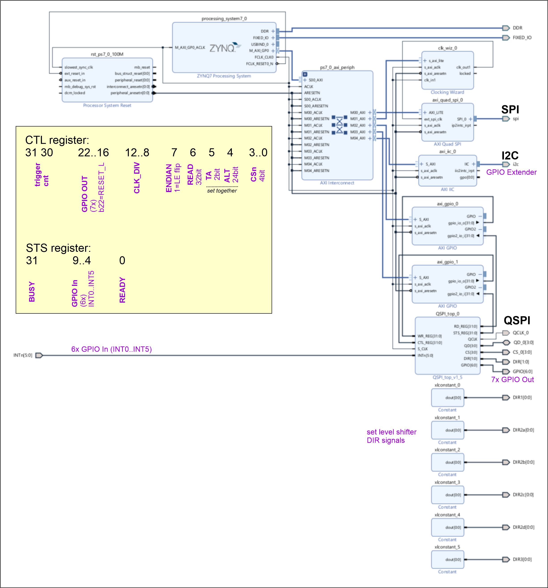

# PYNQ-Z1_GenericQSPI_Blockdiagram
 generic QSPI with PYNQ-Z1 PL overlay

## Generic QSPI
Create a generic QSPI interface on PYNQ-Z1: it should allow to generate
any QSPI transaction (not dependent on QSPI memory devices supported by
the AMD/Xilinx axi_quad_spi IP - it is not generic!).

If you need flexibility in terms of:
* any 8bit command to send (on all or just lane 0, as 1-4-4 or 4-4-4)
* a 32bit ADDR - on all lanes
* a 24bit ALT field - on all lanes
* just 2bit CLK cycles as turnaround
* Nx 32bit write words or reading Nx 32bit words
plus:
* have a QCLKfb signal: a QCLK signal coming in, e.g. delayed by level shifters,
  or delay the read sampling falling edge on QCLK by one SYS_CLK period (10ns later)
* and sample a read response not with the internal QSPI: instead use an
  external QCLKfb in order to compensate the "round trip delay" or sample 10ns later

This is the entire PL overlay project.
ATT: it needs also the "PYNQ-Z1_GenericQSPI_QSPI" project (as a component for
the block diagram.

## Approach
The Generic QSPI is an independent block (with a testbench) to implement
QSPI primitives, e.g.: send a 8bit CMD word, send a 32bit ADDR, send a 24bit
ALT, generate a 2 clock cycle turnaround, do a read with a delayed QCLKfb signal
(as input, delayed as all the data lanes, e.g. due to external level shifters)

The Generic QSPI block uses four registers:
* a WR register (the word to send)
* a RD register (the word samled on data lanes)
* a CTL register (to specify the type what to do on QSPI pins, e.g. 32bit address,
  or generate a turnaorund, generate the nCS signal as 1-of-4)
* a STS register (has the shift out or sample in finished)

## Block Diagram

It contains two AXI_GPIO blocks in order to connect the Generic_QSPI IP block.
There is also a SPI block connected in the usual way.

## Simple Connect via axi_gpio
In order to connect the custom Generic QSPI we need four 32bit registers.
It can be done via an AXI_IPIF block.
Here, to simplify, we use two axi_gpio IP blocks. These provide one 32bit register
out, one 32bitr register in.
We use two in order to connect all of our four Generic QSPI registers to the AXI bus (and entire PYNQ overlay block diagram).

The drawback is: we had to generate a strobe signal via GPIO, so that the
Generic QSPI block would realize: "there is a new command (in the CTRL register).

An improved version could use an AXI_IPIF block and enbedd the same Generic QSPI
RTL code, so that an AXI write would trigger already what to do on QSPI signals.

## Python
The QSPI is used in a Python script (Jupyter Notebook). The Python code for handling the registers
on the AXI_GPIO block is way too slow: it generates huge gaps between the transactions.
In order to speed up - the Python code is augmented to use C-code. The C-code does the entire transaction and is
way faster.
Remark:
Bear in mind that even the C-code needs the MMIO access done via opening the virtual memory mapping ("mmap").

## C-Code
The C-code is located in file write32.c. It has to be compiled as a shared library.
In order to do so:
* place the C-code in a directory "/home/xilinx/c_code
* compile it - step 1:
  gcc -fpic -c -Wall write32.c
* build the shared library - step 2:
  gcc -shared -o libwrite32.so write32.o
This C-code shared library is used by the Python script via CFFI.
It is way faster now.
ATTENTION:
The C-code does not have a flow control. It works fine as long as the QSPI generates fast enough transactions.
The maximum for ther CLK_DIV is 0..3. The maximum QSPI clock speed with CLK_DIV 0 is 33.3333 MHz, 1 is 20 MHz.

