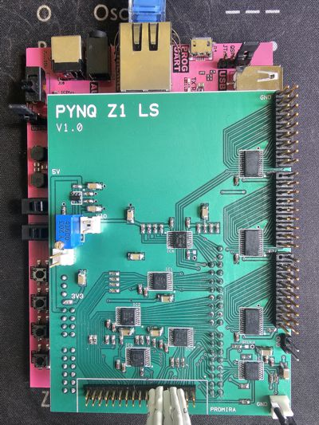

# PYNQ-Z1_GenericQSPI_Blockdiagram
 Generic QSPI with PYNQ-Z1 PL overlay

## Overview
See the overview about this project in a PDF: 

## Generic QSPI
Create a Generic QSPI interface on PYNQ-Z1: it should allow to generate
any QSPI transaction (not dependent on QSPI memory devices supported by
the AMD/Xilinx axi_quad_spi IP - it is not generic!).

If you need flexibility in terms of:
* any 8bit command to send (on all or just lane 0, as 1-4-4 or 4-4-4)
* a 32bit ADDR - on all lanes
* a 24bit ALT field - on all lanes
* just 2bit CLK cycles as turnaround
* Nx 32bit write words or reading Nx 32bit words
plus:
* have a QCLKfb signal: a QCLK signal coming in, e.g. delayed by level shifters,
  or delay the read sampling falling edge on QCLK by one SYS_CLK period (10ns later)
* and sample a read response not with the internal QSPI: instead use an
  external QCLKfb in order to compensate the "round trip delay" or sample 10ns later

This is the entire PL overlay project.
ATT: it needs also the "PYNQ-Z1_GenericQSPI_QSPI" project (as a component for
the block diagram.
This is the QSPI FPGA RTL itself, coming also with a testbench (to simulate and test the QsPI block).
This block is used in the entire project "PYNQ-Z1_GenericQSPI_Blockdiagram".

The maximum QSPI clock speed is 50 MHz (CLK_DIV = 0), half of the PL clock speed.

## Approach
The Generic QSPI is an independent block (with a testbench) to implement
QSPI primitives, e.g.: send a 8bit CMD word, send a 32bit ADDR, send a 24bit
ALT, generate a 2 clock cycle turnaround, do a read with a delayed QCLKfb signal
(as input, delayed as all the data lanes, e.g. due to external level shifters)
You can modify for other parameters, e.g. number of TurnAround cycles.

Only QSPI mode 0 is currently implemented, but you can change the VHDL code for other modes.

The Generic QSPI block uses four registers:
* a WR register (the word to send)
* a RD register (the word sampled on data lanes)
* a CTL register (to specify the type what to do on QSPI pins, e.g. 32bit address,
  or generate a turnaorund, generate the nCS signal as 1-of-4), plus: should we change the byte endian,
  e.g. for data WR and RD part (the CMD, ADDR, ALT are always in big endian!)
* a STS register (has the shift out or sample in finished?)

## Block Diagram

It contains two AXI_GPIO blocks in order to connect the Generic_QSPI IP block.
There is also a SPI block connected in the usual way.

## Waveform
A read transaction looks like this (it is a bit slower as a WR transaction):

## Simple Connect via axi_gpio
In order to connect the custom Generic QSPI we need four 32bit registers.
It can be done via an AXI_IPIF block.
Here, to simplify, we use two axi_gpio IP blocks. These provide one 32bit register
out, one 32bitr register in.
We use two in order to connect all of our four Generic QSPI registers to the AXI bus (and entire PYNQ overlay block diagram).

The drawback is: we had to generate a strobe signal via GPIO, so that the
Generic QSPI block would realize: "there is a new command (in the CTRL register).
This is done via a two bit counter as bit [31:30] on the CTL port: any different value as before triggers a new transaction.

An improved version could use an AXI_IPIF block and enbedd the same Generic QSPI
RTL code, so that an AXI write would trigger already what to do on QSPI signals.

## Python
The QSPI is used in a Python script (Jupyter Notebook). The Python code for handling the registers
on the AXI_GPIO block is way too slow: it generates huge gaps between the transactions.
In order to speed up - the Python code is augmented to use C-code. The C-code does the entire transaction and is
way faster.
Remark:
Bear in mind that even the C-code needs the MMIO access done via opening the virtual memory mapping ("mmap").

## C-Code
The C-code is located in file write32.c. It has to be compiled as a shared library.
In order to do so:
* place the C-code in a directory "/home/xilinx/c_code
* compile it - step 1: 
  gcc -fpic -c -O3 -Wall Generic_QSPI.c
* build the shared library - step 2: 
  gcc -shared -o libGeneric_QSPI.so Generic_QSPI.o
This C-code shared library is used by the Python script via CFFI.
It is way faster now. 

ATTENTION:
The C-code can be used with or without flow control: if the CLK_DIV is small (0..2) - the Python script is slower as the QsPI transactions.
Without using the flow control: the QsPI transactions become more seamless and faster (no gaps in between).
But with a slower QSPI clock: you can increase the PL PLL setting (up to 333.3MHz, 3x faster) or your use the C-code with flow control.
The selection if with or without flow control is done on the C_QSPI_Init() function (via a parameter).

## Use overlay without FPGA synthesis and without C-code compile
Please, find the files needed in folder "overlay":
* design_1.bit and design_1.hwh go (copy) into PYNQ folder "/home/xilinx/pynq/overlays/design_1"
* generic_QSPI.ipynb is the notebook file, copy to "/home/xilinx/jupyter_notebooks"
* libGeneric_QSPI.so is for me on "/home/xilinx/c_code", but it can be also in any of the other folders (just modify in notebook)

## Two different version of Python scripts and C-code libraries
One version assumes, that Python sends all transactions with 32bit version (e.g. also the CMD which is an 8bit transaction on QSPI).
The other version, the names are extended by "packed", assumes that the Python generates a Byte Stream (with CMD as 8bit, ALT as 24bit etc.).
Use the right shared C-code library and Python script.

## Level Shifter Board
The project is designed to work with "my" Level Shifter board.
The QSPI signals, GPIOs (e.g. out and INT as in) go via a level shifter board.
The FPGA (and Python code) could control the direction of the signals (which is IN or OUT, not used really, fix set).

## FPGA QSPI RTL details
All is based on the SYS_CLK. The READ phase is delayed by one SYS_CLK cycle, in order to compensate the delay in FPGA and due to the
Level Shifters.
There is an option to use a QSCLKfb clock: use an external QSPI clock, which is a feedback on the outside into the FPGA, as a READ clock.
This can compensate all FPGA internal delays (e.g. I/O delay) plus tweaking the RC curcuit also the external level shifters.

